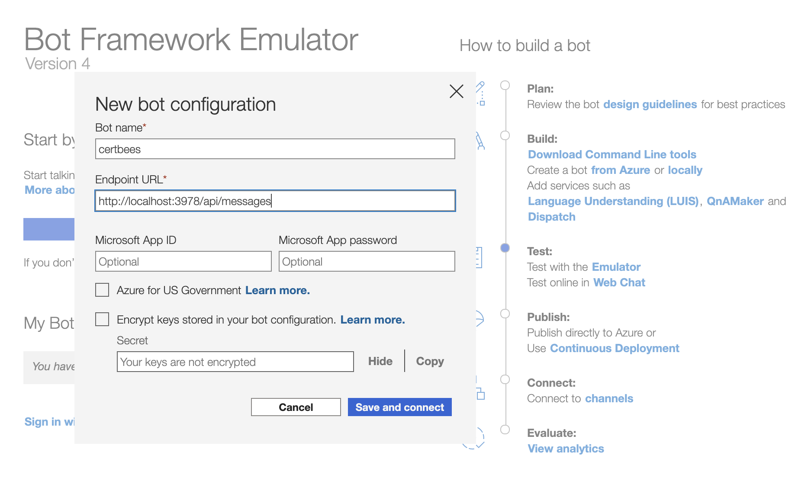

# ChatBot

## Requirements

- [python 3.8.x](https://www.python.org/downloads/release/python-380/)
- [Bot Framework Emulator](https://github.com/microsoft/BotFramework-Emulator) 
- Knowledge of asynchronous programming in Python

## Setup

1. **Setup Virtual Environment** 
```
python3 -m venv .venv
source .venv/bin/activate
```

2. **Download Dependencies** 
```
pip install --upgrade pip
pip3 install -r requirements.txt
```

3. **Run the Utility**
```
export SQL_PASSWORD=<sql password>
python3 app.py
```

4. **Launch Bot Framework Emulator and Configure**  


## References
* [Create a bot with the Bot Framework SDK using Python](https://learn.microsoft.com/en-us/azure/bot-service/bot-service-quickstart-create-bot?view=azure-bot-service-4.0&tabs=csharp%2Cvs)